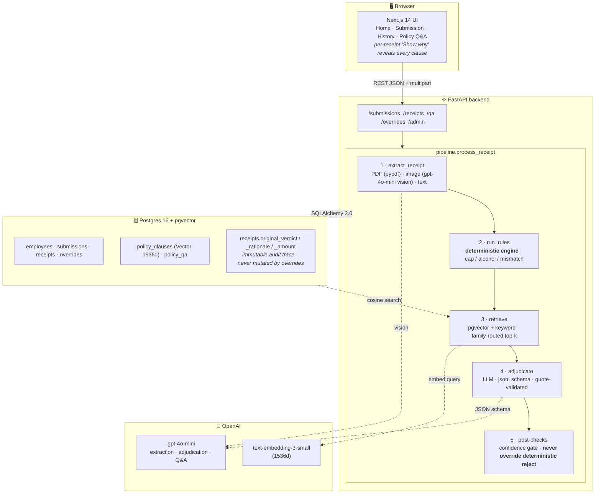

# Northwind Reviewer Copilot

A trustworthy hybrid copilot for expense pre-review at Northwind Logistics.
Every verdict is grounded in a quoted policy clause, every reviewer override is
auditable, and the system refuses to answer when evidence is weak. Built for
the AI Engineer case study; designed as if reviewers actually had to use it.

### 🔴 Live demo

| What | Link |
|---|---|
| **UI** (reviewer dashboard) | <https://northwind-web.onrender.com> |
| **API** (interactive Swagger) | <https://northwind-api-w34f.onrender.com/docs> |
| **Health** (LLM wiring + models) | <https://northwind-api-w34f.onrender.com/health> |
| Repo | <https://github.com/singh7985/northwind-reviewer-copilot> |

> Hosted on Render's free tier — the first request after ~15 min idle wakes the
> container and takes 15–30 seconds. Subsequent requests are instant. If the
> UI looks blank on first load, wait, hard-refresh once, and the seeded
> employees + the 5 case-study submissions will appear.

---

## 1. Problem framing

Northwind's finance team reviews thousands of expense reports a month. Most are
routine — a clean Marriott folio, a $14 airport sandwich — and most of the
reviewer's time is wasted re-deriving the same arithmetic and re-reading the
same `TEP-002 §2.1`. The painful cases are the genuinely ambiguous ones:
*"is this client dinner over the cap because the VP attended? is this rideshare
premium tier justified by an early-morning airport run?"*

The job is not to **replace** the reviewer. It is to:

1. Do the boring deterministic work perfectly (caps, tier uplift, tip %,
   $25 receipt waiver, hard rejects).
2. Read the messy receipt PDFs and images into structured data.
3. Surface the exact policy text behind every verdict so the reviewer can
   accept or override in seconds — with an audit trail either way.
4. Refuse, loudly, when extraction is blurry, retrieval misses, or the
   question is out of scope. Confidently wrong is worse than "I don't know."

**Success metric for the reviewer:** time-to-decision per submission goes down
while their disagreement rate with the system stays under ~10%.

---

## 2. Architecture diagram



**Stack:** Next.js 14 + Tailwind / FastAPI + Pydantic 2 / Postgres 16 + pgvector /
`gpt-4o-mini` for extraction, adjudication, and Q&A (all with `response_format:
json_schema`) / `text-embedding-3-small` (1536d) for clause retrieval.

**Read this diagram top-to-bottom for the request lifecycle, and notice the dotted
LLM edges:** the model is called only at three well-defined points (image OCR,
embedding, adjudication) — everything else is deterministic Python the reviewer
can audit by reading 200 lines of code.

---

## 3. Why this architecture

The fault line in expense review runs cleanly between two kinds of work, and the
biggest design lever is putting each kind on the right tool:

- **Deterministic checks handle arithmetic and policy thresholds better than any
  LLM ever will.** Daily meal caps, tier-uplift, tip percentages, the $25 receipt
  waiver, "no first class," "no solo-travel alcohol" — these are mechanical and
  must be exact. A rules engine produces the same answer every time, is unit-testable,
  and can never hallucinate a $100 cap as $150. So the deterministic engine owns
  every number and every hard reject.

- **The LLM handles ambiguity and explanation.** "Was this dinner a client meeting
  per TEP-001 §3.2?" requires reading context. So does writing a one-paragraph
  rationale a reviewer can actually scan. We let `gpt-4o-mini` do that work, but
  only after we've handed it the retrieved policy clauses, and only with
  `response_format: json_schema` so the output is parseable.

- **Clause-level retrieval improves citation faithfulness.** Policies have structure
  (`TEP-002 §2.1 Daily meal caps`). We parse each PDF, detect document headers and
  section numbering, and store **one embedded row per clause**. Citations are
  therefore clause IDs, not page-spans — exactly what an auditor expects.
  Retrieval is family-routed (a meal receipt sees meals/alcohol/travel_overview,
  not lodging), then re-ranked with keyword and clause-type boosts.

- **The human-review gate is safer than forcing an answer.** If
  `extraction_confidence < 0.35`, if retrieval brings back nothing on-topic, or
  if the adjudicator's quotes don't appear in the retrieved set, the verdict is
  forced to `needs_human_review` rather than guessed. The model is allowed to
  *explain*; it is never allowed to *override* a deterministic `reject`.

| Concern | Owner | Why |
|---|---|---|
| OCR / receipt → structured JSON | LLM (with vision) + regex fallback | Reading messy receipts is the LLM's strength. |
| Hard math (caps, tier uplift, tip %, $25 waiver) | Deterministic engine | Must be exact and unit-testable. |
| Hard rejects (first class, solo-travel alcohol, minibar) | Deterministic engine | Policy says no; the LLM should never argue. |
| Judgment ("was the QBR a client meeting?") | LLM adjudicator | Genuinely subjective; rules can't capture it. |
| Verdict prose + citations | LLM, grounded on retrieved clauses only | Reviewers need a quotable rationale. |
| "I don't know" | Confidence gate forces `needs_human_review` | Better than a confident wrong answer. |

---

## 4. Rule engine vs LLM tradeoff

The tradeoff is **determinism and auditability vs. flexibility and language**.
A pure rules engine can verify caps to the penny but cannot tell a client dinner
from a personal one. A pure LLM can read any receipt format but will silently
mis-cite a cap or fabricate a section number. We pay a small complexity cost
to keep both, and design the seam between them carefully:

| | Rules engine | LLM adjudicator |
|---|---|---|
| **Owns** | Numbers, thresholds, hard rejects, fee math | Categorisation, ambiguity, written rationale, citations |
| **Output shape** | List of typed `Finding(rule_id, severity, message, policy_doc, policy_section, delta_amount)` | JSON object validated against a strict schema |
| **Failure mode** | Brittle if policy changes; cannot reason about novel cases | Hallucinated caps, fabricated section numbers, sycophancy |
| **Mitigation** | Each rule cites its policy section in code; new rules are PRs | Family-routed retrieval, quote-validated citations, never-override-reject post-check |
| **Auditability** | Trivial — every `Finding` is logged with `rule_id` | Adjudicator output is persisted with `policy_refs` and `quoted_clauses` |

The hard rule we enforce in code: **the LLM can never lift a deterministic
`reject`.** If the engine says reject and the LLM says compliant, the post-check
flips it back and downgrades confidence. This single asymmetry is what makes the
hybrid safe to ship.

---

## 5. Retrieval design

Bad retrieval is the silent killer of RAG systems. Clause-level chunking and a
hybrid retriever give us citations a reviewer can actually trust.

1. **Clause-level ingest.** `policy_loader.py` parses each `policies/*.pdf` with
   `pypdf`, splits on `Document: TEP-NNN` headers, then on `N.N` section
   numbering, and stores one row per clause with `(doc_id, section,
   clause_title, clause_type, text, embedding Vector(1536))`. We tag a small
   `clause_type` taxonomy (`cap`, `prohibition`, `definition`, `procedure`,
   `eligibility`, `documentation`) used as a retrieval boost.

2. **Family routing.** Receipts are classified into a small family
   (`meals`, `lodging`, `air`, `ground`, `conference`, `other`) and retrieval is
   restricted to a relevant set per family (`adjudicator.FAMILY_ROUTE`).
   A meal receipt never has to compete with lodging clauses for top-k slots.

3. **Hybrid scoring.** `find_clauses()` pulls `4*k` candidates by cosine
   similarity, `2*k` by keyword overlap on tokens extracted from the receipt
   (merchant, category, line items), boosts by `clause_type` relevance, and
   returns the top-k unique clauses with their similarity scores intact.

4. **Quote validation.** Before persisting the LLM's verdict, `_validate_quotes()`
   walks every `quoted_clause` and drops any whose text is not a substring of a
   retrieved clause. If all supporting quotes for a `compliant` verdict get
   stripped, the verdict is downgraded to `needs_human_review`. Citations cannot
   be hallucinated.

---

## 6. Confidence strategy

Three cheap mechanisms keep the system honest:

1. **`extraction_confidence`** (0–1) is requested in the extractor's JSON schema.
   If it falls below `0.35`, the pipeline short-circuits to
   `needs_human_review` regardless of what the adjudicator would have said.

2. **Adjudicator `confidence`** (0–1) is also schema-required and rendered as a
   color-coded `ConfidenceBadge` in the UI (≥0.75 emerald, ≥0.5 amber, else
   rose). Reviewers immediately see whether the model is sure or guessing.

3. **The asymmetric override rule.** The LLM can downgrade `compliant` (e.g.
   *"this looks fine but I see a tip over 20%"* → `flagged`). It cannot upgrade
   `rejected` to `compliant`. This is enforced in `pipeline.process_receipt`
   after adjudication, before persistence.

The user-facing payoff: low-confidence verdicts arrive *visibly* low-confidence.
Reviewers route their attention to the amber/rose badges and trust the emerald
ones, instead of treating all outputs as equally credible.

---

## 7. Evaluation methodology

The eval harness (`eval/harness.py`) follows two principles from OpenAI's
evaluation guidance: evals are a **continuous development tool**, and **RAG
quality decomposes into retrieval vs. answer quality** — single accuracy numbers
hide which side is failing.

It computes:

| Metric | What it measures | Why it's separate |
|---|---|---|
| `verdict_accuracy` | System verdict == expected verdict | Headline number |
| `category_accuracy` | Extracted category == expected | Pinpoints extraction regressions |
| `retrieval_hit_rate` | Was the expected `TEP-XXX` in the retrieved clause set? | **Retrieval** leg of RAG |
| `citation_correctness` | Precision *and* recall of cited docs vs. expected | **Reasoning** leg of RAG — catches over-citation as well as omission |
| `extraction_completeness` | Fraction of `expected_fields` that came back non-null | Per-field breakdown |
| `reimbursable_amount_accuracy` | Actual within $1 of expected | Catches cap-arithmetic drift |
| `override_agreement` | Across all persisted submissions, how often `original_verdict == current_verdict` | The realest possible metric — production agreement with human reviewers |
| `oos_refusal_rate` | % of out-of-scope Q&A questions correctly refused | Refusal behavior under load |
| `adversarial.pass_rate` | Blurry / missing-line-items / contradictory / mixed-format fixtures handled defensively | Robustness under failure |
| `adversarial.irrelevant_policy_questions.refusal_rate` | Refusal rate on submarine / lunar / Atlantis questions | Refusal under absurdity |

The expected-outcomes file (`eval/expected_outcomes.v2.json`) is a flat
per-receipt format:

```json
{
  "receipt_id": "03_dinner_over_cap/04_dinner_alinea",
  "submission_dir": "03_dinner_over_cap",
  "filename": "04_dinner_alinea.pdf",
  "expected_verdict": "flagged",
  "expected_category": "meal_dinner",
  "expected_policy_refs": ["TEP-001"],
  "expected_failure_reason": "meal cap exceeded",
  "expected_reimbursable_amount": 75.0,
  "expected_fields": ["merchant", "total", "category"]
}
```

Run with a CI gate:

```bash
python -m eval.harness --fail-under 0.7
```

Writes `eval/last_report.json`. Exits non-zero if `verdict_accuracy` drops
below the threshold so the same script runs locally and in GitHub Actions.

---

## 8. Cost per submission

Per submission of ~5 receipts on `gpt-4o-mini` (input $0.15 / 1M, output $0.60 / 1M):

| Step | Calls | ~tokens | Cost |
|---|---|---|---|
| Extraction (text-first; vision only for images) | 5 | 1.0k in / 0.3k out | ~$0.002 |
| Adjudication (slimmed clause context, top-5) | 5 | 1.5k in / 0.4k out | ~$0.003 |
| Embedding | 0 per submission | (one-shot per policy release) | $0 |
| **Total** | **~10** | — | **≈ $0.005 / submission** |

Notable line-item levers:

- The adjudicator prompt is deliberately **slimmed** (`_slim_extracted` whitelists
  ~22 fields; `_slim_clauses_for_llm` shows only `doc_id/section/title/type/quote`).
  This is the single biggest input-token saver.
- `MAX_LLM_CLAUSES = 5` out of a `RETRIEVAL_POOL = 12`. We retrieve generously
  and pass the LLM only what made the cut.
- Q&A is `~$0.001` per question and only used in the dedicated tab.

---

## 9. Scaling to 10k/day

At ~$0.005/submission that's **~$50/day in LLM spend** — a rounding error against
reviewer time. The interesting scaling moves are operational:

- **Extraction and adjudication can be async jobs.** Today they're inline behind
  the upload, which is fine at case-study scale. At 10k/day the upload should
  return immediately with a `queued` receipt and a Celery/RQ/Cloud Run job
  should run the pipeline. The data model already supports it (`Receipt.verdict`
  is nullable until processed), and the UI already polls.

- **Heavy prompts benefit from prompt caching when the policy prefix / system
  prompt repeats.** Both our extractor and adjudicator share a long stable
  system prompt and a stable JSON schema; OpenAI's prompt-caching credits any
  prefix re-used within a short window, so latency and input-token cost drop
  significantly once warm. We just need to keep the cacheable prefix verbatim
  across calls — already true today because we don't string-interpolate into it.

- **Policy retrieval is lightweight once indexed.** pgvector with an IVF index
  on ~100 clauses runs in low single-digit milliseconds and scales linearly with
  policy size, not submission rate. We never re-embed at request time.

- **Old submissions and traces can be archived separately.** The audit trail
  (extraction JSON, retrieved clauses, quoted clauses, overrides) is what makes
  this system trustworthy but also what makes it heavy. After ~90 days we'd
  move `receipts.extracted`, `receipts.retrieved_clauses`, and the override
  rows to cold storage (S3 + Glacier or a partitioned archive schema), keeping
  only the verdict summary hot. Hot tables stay small; reviewer queries stay fast.

- **Selective model uplift.** The confidence gate is also a routing primitive —
  send `extraction_confidence < 0.7` receipts to `gpt-4o` only, so the average
  cost stays at mini levels while accuracy on the hard tail improves.

- **Per-employee trust score** routes low-risk traveler submissions through a
  lighter-weight path and reserves human-review budget for high-risk patterns.

---

## 10. Next steps

1. **Active learning loop.** Every reviewer override is a labeled disagreement;
   surface them weekly to refine prompts, add deterministic rules where the
   LLM keeps getting overridden in the same direction, and grow the eval set.
2. **Policy diff awareness.** When a clause changes, re-evaluate the last N
   days of submissions against the new text and flag verdicts that would flip.
3. **100-receipt golden set with adversarial cases.** Today's harness has 7
   labeled cases + 4 adversarial fixtures + 9 OOS/irrelevant questions. The
   right next step is a 100-receipt set with look-alike alcohol terms,
   borderline tip percentages, mixed-attendee meals.
4. **RBAC + SSO and a per-reviewer queue.** The data model supports it
   (`Override.reviewer`, `Submission.status`); the UI doesn't yet.
5. **Side-by-side reviewer mode** showing both the original adjudicator output
   and the current state, so reviewers can disagree with full context.

---

## Running locally

For a containerised stack (db + backend + frontend), see [DEPLOY.md](DEPLOY.md).
The local-dev loop below is faster for iteration.

### Prerequisites

- Docker (for Postgres + pgvector)
- Python 3.11+ and Node 18+
- *Optional:* `OPENAI_API_KEY`. Without it the system runs in **deterministic-only**
  mode — useful for offline demos and for the eval harness.

### Setup

```bash
cp .env.example .env
docker compose up -d db                # postgres + pgvector on :5432

python -m venv .venv && source .venv/bin/activate
pip install -r backend/requirements.txt
cd frontend && npm install && cd ..
```

### Run

```bash
# terminal 1 — API
source .venv/bin/activate
cd backend && uvicorn app.main:app --reload --port 8000

# terminal 2 — UI
cd frontend && npm run dev

# terminal 3 — seed (idempotent: schema, employees, policy ingest + embeddings)
curl -X POST http://localhost:8000/admin/seed
```

Open <http://localhost:3000>. Use the **demo buttons** to ingest one of the 5
sample submissions; receipts appear with verdicts and full audit panels.

### Eval

```bash
source .venv/bin/activate
python -m eval.harness \
  --expected ./eval/expected_outcomes.v2.json \
  --oos      ./eval/oos_questions.json \
  --adversarial ./eval/adversarial.json \
  --adv-dir  ./eval/adversarial \
  --fail-under 0.7
```

---

## Repo map

```
backend/
  app/
    api/                    # FastAPI routers
    services/
      extraction.py         # PDF / image / text → ExtractedReceipt
      deterministic.py      # the rules engine — the trust core
      policy_loader.py      # clause-level parsing + hybrid retrieval
      adjudicator.py        # LLM verdict, family-routed, quote-validated
      qa.py                 # policy Q&A with refusal behavior
      pipeline.py           # orchestration, confidence gate, never-override
      llm.py                # OpenAI wrapper with offline fallback
    models.py               # SQLAlchemy + pgvector + immutable trace columns
    schemas.py              # Pydantic 2 DTOs (incl. all LLM output schemas)
frontend/
  app/
    page.tsx                # home: picker, new submission, demo buttons
    submissions/[id]/...    # review: receipts, verdicts, "show why", override
    history/page.tsx        # filterable submission history with override trail
    qa/page.tsx             # policy Q&A with citations and refusal
  components/
    ConfidenceBadge.tsx     # color-coded confidence pill
eval/
  harness.py                # 8 metrics + adversarial + CI gate
  expected_outcomes.v2.json # flat per-receipt expectations
  oos_questions.json        # 6 OOS trap questions
  adversarial.json          # adversarial fixtures + irrelevant policy probes
  adversarial/              # blurry / missing-items / contradictory / mixed
policies/                   # case-study PDFs (TEP-001..TEP-008 + noise)
submissions/                # 5 sample submissions used by demo buttons + eval
```
